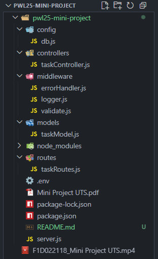
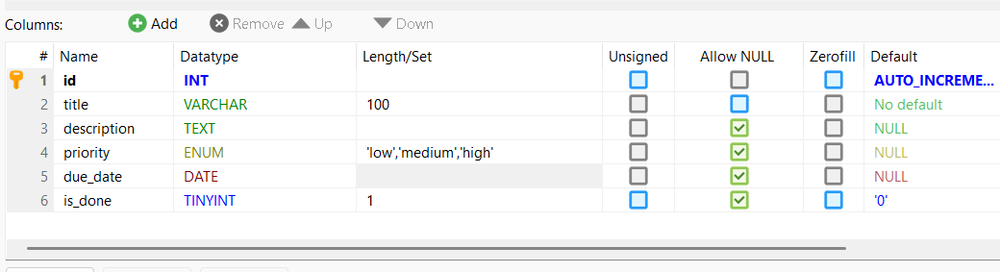
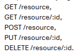
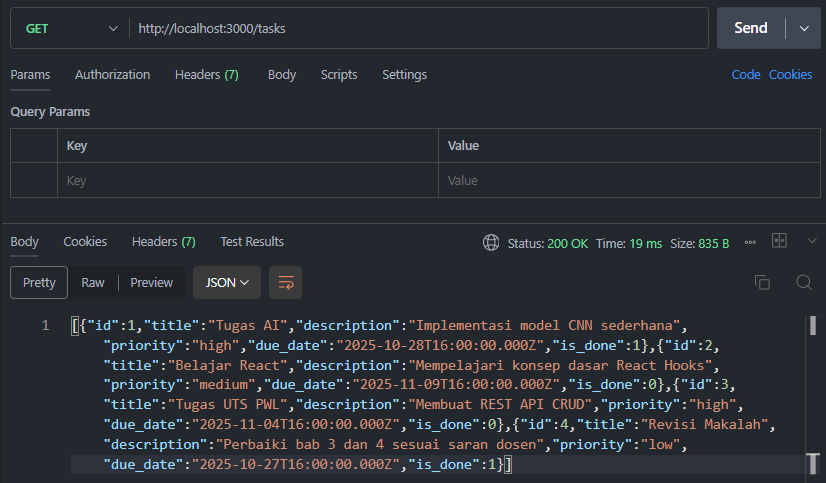
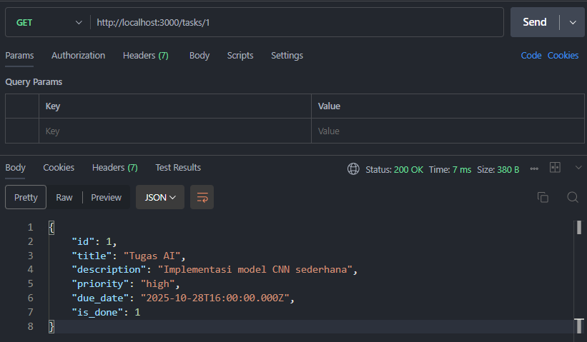
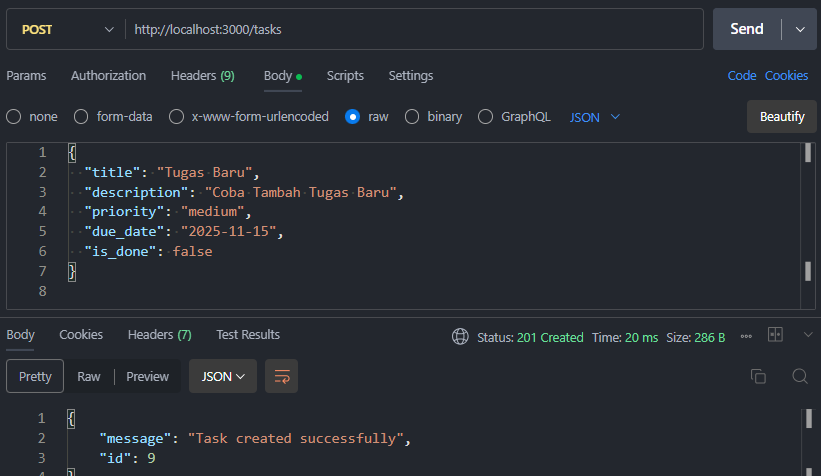
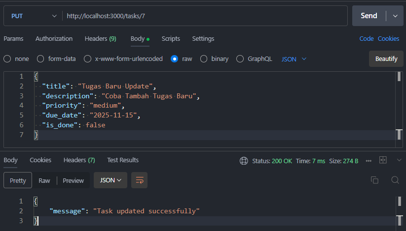
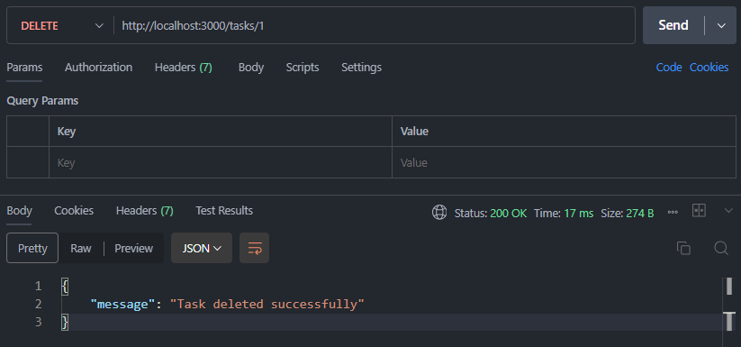

# Mini Project UTS – Tasks API (Express.js + MySQL)

## 📘 Deskripsi
Project ini dibuat untuk memenuhi **Ujian Tengah Semester (UTS)** mata kuliah **Pemrograman Web Lanjut**.  

Tujuan dari tugas ini adalah agar dapat memahami cara membangun **RESTful API** menggunakan **Express.js** dengan struktur **MVC**, serta menghubungkannya ke **database MySQL**.

Kasus yang diangkat dalam project ini adalah **manajemen tugas (Tasks API)** yang dapat melakukan operasi **CRUD (Create, Read, Update, Delete)**.

---

## ⚙️ Teknologi yang Digunakan
- **Node.js**
- **Express.js**
- **MySQL**
- **dotenv** (untuk konfigurasi environment)
- **Postman** (untuk pengujian endpoint)
- **Laragon** sebagai server database lokal

---

## 📂 Struktur Folder


---

## ⚙️ Instalasi & Konfigurasi

1.  **Clone repository ini**
    ```bash
    git clone https://github.com/username/pwl25-mini-project.git
2.  **Masuk ke folder project**
    ```bash
    cd pwl25-mini-project
    Install dependencies
    npm install
3.  **Buat file .env**
    ```bash
    DB_HOST=localhost
    DB_USER=root
    DB_PASSWORD=
    DB_NAME=tasks_db
    PORT=3000
4.  **Jalankan server**
    ```bash
    node server.js

---

## 🗄️ Struktur Tabel Database


## 🌐 Endpoint API


## 🧪 Pengujian Menggunakan Postman
1. Pastikan server berjalan (node server.js)
2. Buka Postman
3. Lakukan pengujian dengan endpoint berikut:

🔹 GET /tasks -> Menampilkan semua data tugas


🔹 GET /tasks/:id -> Menampilkan data tugas berdasarkan ID


🔹 POST /tasks -> Menambahkan data tugas baru


🔹 PUT /tasks/:id -> Mengubah data tugas


🔹 DELETE /tasks/:id -> Menghapus data tugas


---

## ⚙️ Middleware yang Digunakan
| Middleware | Fungsi |
|------------------|--------|
| **logger** | Mencatat setiap request yang masuk ke server (method, URL, dan timestamp) ke console untuk memudahkan proses debugging dan monitoring. |
| **validate** | Memeriksa apakah semua field (`title`, `description`, `priority`, `due_date`) telah diisi sebelum data dikirim ke server. Jika ada yang kosong, akan mengembalikan respons error 400. |
| **errorHandler** | Menangani semua error yang terjadi di aplikasi dan mengembalikan pesan kesalahan dalam format JSON agar respons tetap konsisten. |

---

## 📌 Kesimpulan
Project ini berhasil mengimplementasikan CRUD REST API dengan arsitektur MVC, middleware custom, dan koneksi ke database MySQL.
Dengan memanfaatkan Express.js, pengembangan API menjadi lebih terstruktur, modular, dan mudah untuk dikembangkan lebih lanjut.